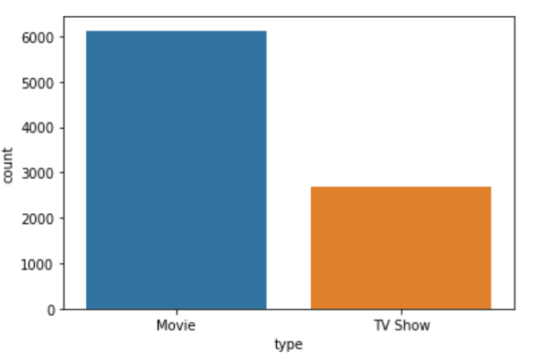
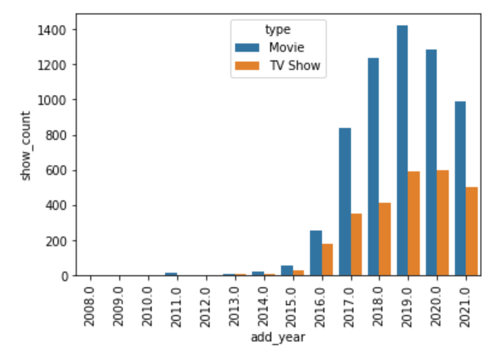
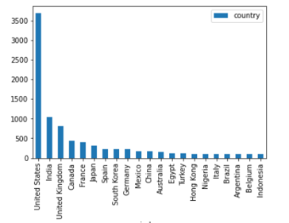
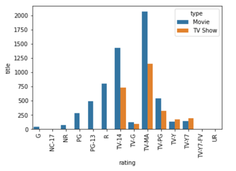
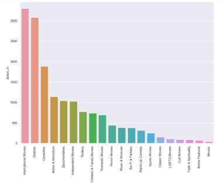
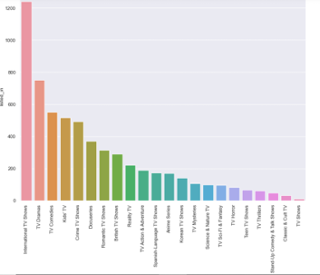
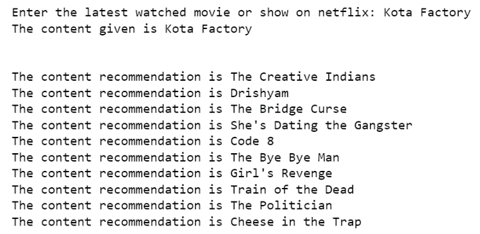

# RECOMMENDER_SYSTEM

# Introduction

For more details, refer to [PPT](https://docs.google.com/presentation/d/1jWxrQbYE8iKIu6eRRn7o7LtaAg4HCvXw/edit?usp=sharing&ouid=115224514884735671589&rtpof=true&sd=true).
Building a content-based recommendation system by calculating the item-item interaction from the given data. Inputting the valid NETFLIX name of the Movie or the TV Show will lead to the model making the description of the content-based recommendations. 

# Description

The model used for recommendation is a combination of the Tfidf Vectorizer for text-to-vector conversion and then the unsupervised algorithm of Nearest Neighbors was used to find the cosine distance between the vectors corresponding to the movies/TV shows.  The recommendations will be based on the minimum cosine distance i.e., maximum cosine similarity between the two movies, a movie, and a TV show or TV show and a TV show. 

# Dataset

We used 3 different datasets and then merged them to form the final dataset. All of them are available on Kaggle. 
Netflix Movies and Shows: https://www.kaggle.com/shivamb/netflix-shows  
IMDB Movies and Shows: https://www.kaggle.com/stefanoleone992/imdb-extensive-dataset  
IMDB Ratings: https://www.kaggle.com/stefanoleone992/imdb-extensive-dataset    

They are given in the datasets folder. Use accordingly in the notebook. 

# EDA

A few of my insights are as follows:

Number of Movies and TV Shows

Number of additions vs. years

Top Producing Countries

Number of Items vs. Ratings

Top Genres: Movies (T); TV Shows (R)

# Model

The top 10 recommendations are given for Kota Factory based on Content-Based Filtering. 

The top 10 recommendations are given for Avengers: Infinity War based on Content-Based Filtering.

# Metrics
No metrics are evaluated there is no explicit test dataset to represent the correct answers. 

 based on Content-Based Filtering. 

